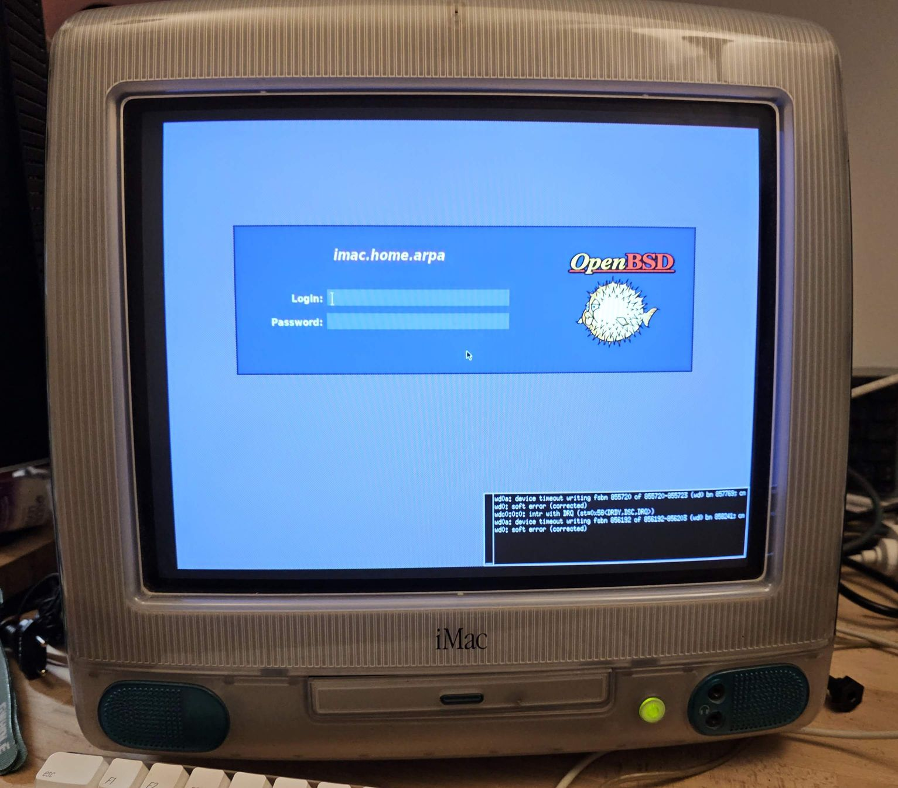

# imac-g3-266mhz-OpenBSD

I'm installing OpenBSD on an old Imac G3 266Mhz !!



```
imac# sysctl hw
hw.machine=macppc
hw.model=750 (Revision 0x202)
hw.ncpu=1
hw.byteorder=4321
hw.pagesize=4096
hw.disknames=wd0:07a9d38aa5366298,cd0:,sd0:
hw.diskcount=3
hw.cpuspeed=266
hw.vendor=Apple Computer, Inc.
hw.product=iMac,1
hw.physmem=402653184
hw.usermem=402636800
hw.ncpufound=1
hw.allowpowerdown=1
hw.ncpuonline=1
hw.power=1
hw.ucomnames=
```
